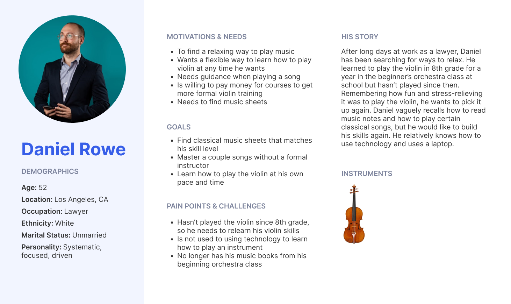
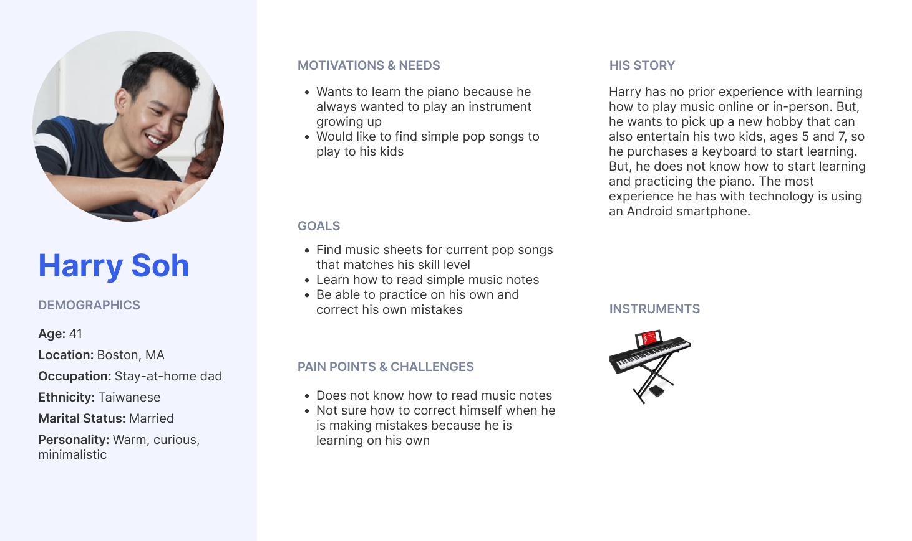
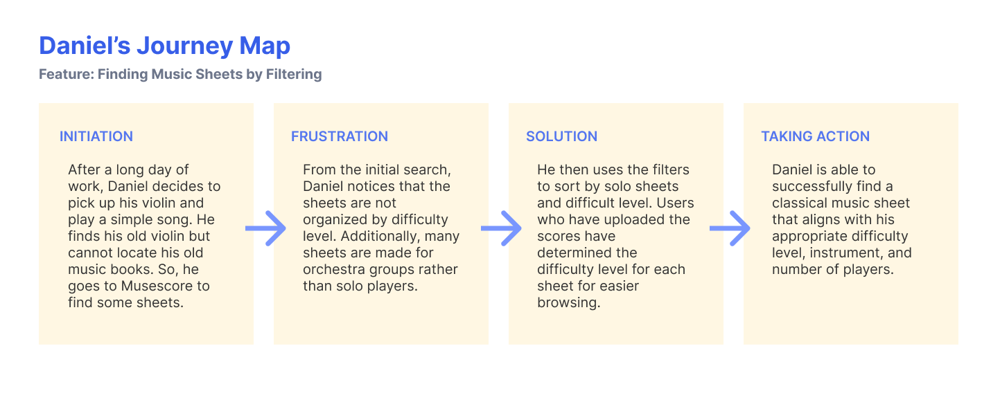
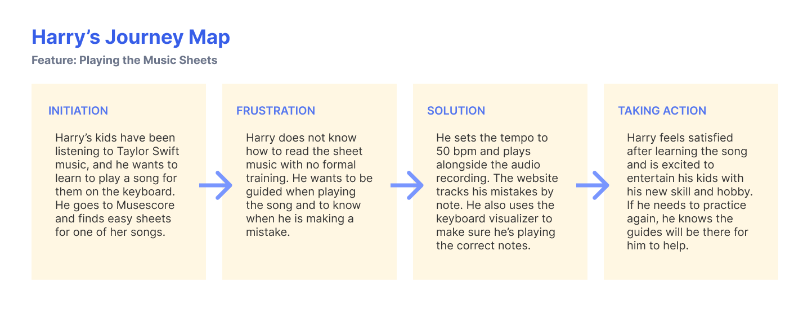

# **Making Music Learning Accessible**
## Assignment 04 - Personas + Scenarios
Chantal Tan | DH 110

### The Purpose of UX Storytelling
- To better understand the user’s goals, motivations, pain points, and needs
- See from the perspective of the target user group, especially when the demographics and experiences vary widely from the researchers’
- Allows UI/UX designers to put the user first when moving forward with designs

### Design Tasks
- Find relevant music sheets pertaining to the genre and instrument the user desires
- Allow the user to easily play alongside the music sheets

### Personas & Empathy Maps
#### Persona 1: Daniel Rowe

**Empathy Map**

#### Persona 2: Harry Soh

**Empathy Map**

### Scenarios & Journey Maps
#### Daniel's Scenario and Journey Map

**Why**

Daniel is a seasoned lawyer who wants to relax and wind down after work. He thinks of picking up the violin again after having not played it for almost 35 years. He lost his music books and wants to find sheets for classical songs. He wants to start easy and slowly learn to sight-read on his own. Since he is relatively good with technology, he looks up websites to find music sheets and finds Musescore.

**How**

When trying to find a new song, Daniel browses the home page of Musescore. He uses the filters to narrow down his browsing recommendations. While browsing the available sheets, he notices they are not sorted by difficulty level. However, he goes ahead and sorts it by the “Classical” genre and the “violin” instrument. After selecting those, he realizes his results are a mix of solo and mixed duet/orchestra pieces. He goes back to the filters and selects “Solo.” After browsing the music sheets and seeing previews, he feels satisfied with one sheet and selects it.

#### Harry's Scenario and Journey Map

**Why**

Harry finds that his kids, ages 5 and 7, are entertained when listening to pop songs like those by Taylor Swift. He also has been thinking about learning an instrument for fun in his free time as a stay-at-home dad. He realizes he had always wanted to play the piano, and now he can learn to play fun songs for his kids! So, he uses Musescore to find and learn how to play simple pop songs so that he can entertain his kids when they come home from school.

**How**

After Harry has found the appropriate songs in page length, difficulty level, instrument, and artist, he proceeds to play alongside the audio recordings. He sets the tempo to a slower pace using the metronome feature and presses the play button. When he consistently messes up during a measure, he tries to record himself to catch how his mistake is being made. Since he does not know how to sight-read well, he also uses the keyboard visualizer to visualize where each note is when played.

