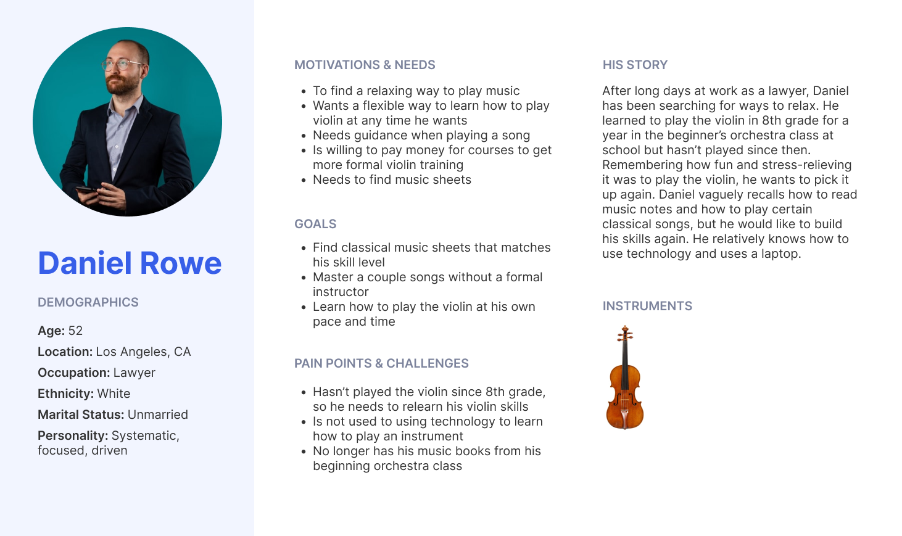

# **Making Music Learning Accessible**
### Chantal Tan | DH 110

## Introduction
Learning how to play a new instrument at an older age can be daunting and challenging. From learning how to sight-read, finding music sheets that are appropriate to play, and practicing alone, there are some key aspects a music learning platform must provide to create a smooth, accessible learning experience. 

When I am finding music sheets online, I usually use the website Musescore. Although I figured out how to use it, there was a slight learning curve with using its features. I then wondered: how would middle-aged men feel about this app? The pain points I experienced may be exasperated to an audience who is older or has less familiarity with technology. Through this project, I hope to explore how the process of browsing songs and practicing with music sheets online can be made more seamless for the target audience of middle-aged men by redesigning the Musescore website.

## Design Statement
When evaluating the Musescore website, I noticed it provided a lot of information about individual music sheets (including length in minutes, pages, uploader, and reviews, among others), almost in excess. There was not a clear hierarchy of these details, and with music sheet playing controls displayed on the same page, the website felt cluttered and overwhelming. I wanted to improved the navigation and playing experience for those with a variety of technological and musical experiences. 

So I asked:
>  How might I design an easier, accessible music learning experience that empowers middle-aged men to learn at an older age?

## Competitor Analysis
### Heuristics Analysis
I conducted heuristic analyses on Musescore and SmartMusic based on Nielsen Norman's 10 Usability Heuristics for UI Design and Severity Ratings for Usability Problems. The core task I completed to evaluate the apps were: browse for a song and attempt to play a song using the music sheets and varied methods of reading the sheets. This analysis informed what usability problems I could fix in my redesign. Read more [here](https://github.com/chantaltan/DH110-CHANTALTAN/blob/main/assignment01/README.md). 

### Usability Testing
I also conducted a pilot usability test on the Musescore website to further validate my analysis and see if they can use the site as intended. Read more [here](https://github.com/chantaltan/DH110-CHANTALTAN/blob/main/assignment02/README.md). 

## User Research
To better understand my target users, I conducted a user interview and contextual inquiry. Through asking questions about the participants’ music background and observing how they would use Musescore, my goal was to learn: (1) how the target users usually find and learn music to play; (2) the resources the target users use to learn; and (3) the difficulties of their current methods of learning and how that can be improved with an online app. Find the recording, notes, and insights [here](https://github.com/chantaltan/DH110-CHANTALTAN/blob/main/assignment03/README.md). 

## UX Storytelling
From the competitor analysis and user research, I then formed user personas, empathy maps, and journey maps to better empathize with the users’ goals, motivations, pain points, and needs. My two personas represent different experiences in my target user base, and as I moved forward with my designs, I made sure to design for their needs. Below is a sample of a persona, and you can find more [here](https://github.com/chantaltan/DH110-CHANTALTAN/blob/main/assignment04/README.md). 

## Low-Fidelity Wireframe
Using the insights gained from user research, I sketched low fidelity wireframes and created a wireflow. This method was tested to tackle which features should or should not be included, as well as see where the design flow might present points of confusion. 
The tasks designed included the following:
1. Find music sheets by filtering
2. Play the music sheets
3. Find courses to learn instruments and how to sight-read
4. Save music sheets to be viewed in a profile for later viewing

Read more [here](https://github.com/chantaltan/DH110-CHANTALTAN/blob/main/assignment05/README.md). 

  

  

  
## Low-Fidelity Prototype and GUI Variations
I converted the sketches into a low-fidelity prototype on Figma and further structured the information and features along a grid. After this, I made graphic UI variations in color, typography, and shapes, which was screened through an impression test. The impression test gave insights on what looked better to the user and informed the final design system. Read more [here](https://github.com/chantaltan/DH110-CHANTALTAN/blob/main/assignment06/README.md).

## High-Fidelity Prototype
Upon implementing the design system across the website and testing it for accessibility (color contrast check), I had my initial high-fidelity prototype. I conducted two cognitive walkthroughs to determine if users could easily go through each task and if anything was missing. Iterations were then made to create the high-fidelity prototype you see below. Find the full iteration process and insights [here](https://github.com/chantaltan/DH110-CHANTALTAN/blob/main/assignment07/README.md). 

<iframe style="border: 1px solid rgba(0, 0, 0, 0.1);" width="800" height="450" src="https://www.figma.com/embed?embed_host=share&url=https%3A%2F%2Fwww.figma.com%2Fproto%2FC4mhVS68SXBz0grFeql6tK%2FDH-110-Project%3Fnode-id%3D163%253A3583%26scaling%3Dscale-down-width%26page-id%3D199%253A8576%26starting-point-node-id%3D197%253A5368%26show-proto-sidebar%3D1" allowfullscreen>
  </iframe>

## Conclusion
Through this project, I was able to redesign the Musescore app to make it more navigable and easy-to-use for middle-aged men while maintaining their core tasks of finding music sheets and learning to play the sheets.

I learned a lot about how to structure the design process, especially how to integrate research into designs as well as testing and iteration into each part of the design stages. Creating personas also helped me better understand different use cases for the app. Ultimately, I realized that there are many ways to design a single task, but what might seem the most innovative or unique may not always be the most intuitive. Testing helps with providing rich insights into what does and does not work in a prototype, and if I had more time, I would conduct usability testing on the high-fidelity prototypes and continue iterating to create a more complete, intuitive music learning experience.

